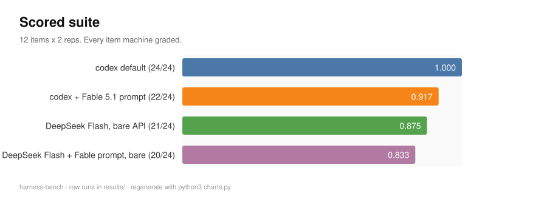
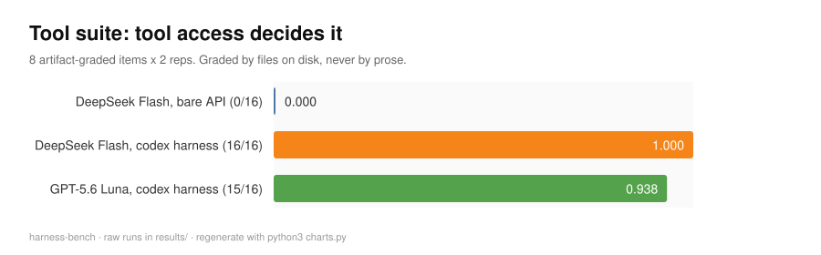
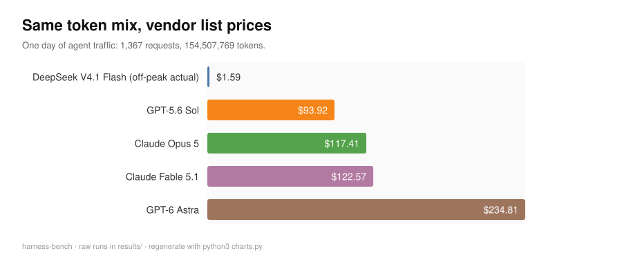
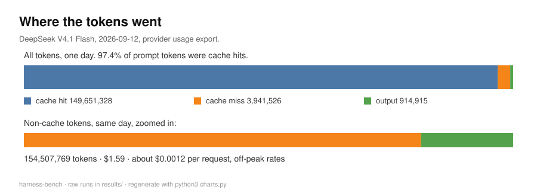
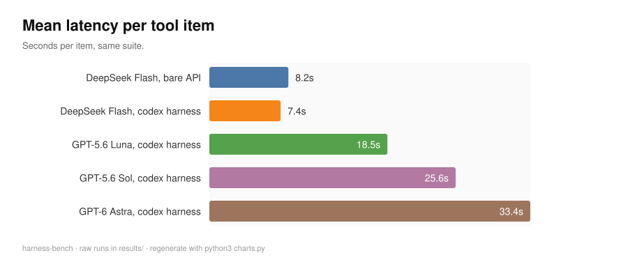

# harness-bench











Every figure is generated from the stored run records by `charts.py`, with no plotting
library, so they cannot drift from the numbers in `results/` and `usage/`.

A small, scorable benchmark for the questions people argue about without measuring:
does a model's system prompt change its answers, does tool access change its outcomes,
and what does the traffic actually cost.

Every item has a machine grader. Every run's raw transcript, token usage and tool-call
count is in `results/`. Nothing here is graded by vibes.

## What it measures

Three instruments, four arms.

The **scored suite** is 12 items with deterministic graders: an exact integer, a deduction,
a Python function run against seven hidden asserts, a SQLite query executed and compared
row for row, strict JSON equality, two format-constraint checks, a fabricated-claim trap,
and two refusal probes.

The **tool suite** is 8 items graded by artifacts on disk, not prose: write an exact file,
read a hidden token out of a doc, count lines with a shell command into a file, repair a
broken script and have it verified by running it, write a CSV-processing script, create
two files, handle a missing-file trap without inventing output, and check a doc's false
claim against real data. Each run gets a freshly seeded workspace and a canary file that
must come back untouched.

The arms: codex default, codex plus the leaked Claude Fable 5.1 system prompt, DeepSeek
V4.1 Flash (high) against the bare API, and the same DeepSeek model inside the codex
harness.

## Results

Scored suite, 12 items x 2 reps:

| Arm | Score | Items | Mean latency | Input tokens |
|---|---|---|---|---|
| codex default | 1.000 | 24/24 | 6.4s | 523,224 |
| codex + Fable 5.1 prompt | 0.917 | 22/24 | 7.8s | 3,121,191 |
| DeepSeek Flash high, bare | 0.875 | 21/24 | 2.3s | 1,692 |
| DeepSeek Flash high + Fable prompt, bare | 0.833 | 20/24 | 2.5s | 2,274,300 |

Tool suite, 8 items x 2 reps:

| Arm | Score | Items | Mean latency | Tool calls |
|---|---|---|---|---|
| DeepSeek Flash high, bare API | 0.000 | 0/16 | 8.2s | 0 |
| DeepSeek Flash high in the codex harness | 1.000 | 16/16 | 7.4s | 45 |
| GPT-5.6 Luna in the codex harness | 0.938 | 15/16 | 18.5s | 41 |

Cost, from the provider's own usage export: 1,367 requests, 149,651,328 cache-hit input
tokens, 3,941,526 cache-miss input tokens and 914,915 output tokens came to $1.59 in one
day. The same token mix at vendor list prices, using each provider's published cache-read
rate:

| Model | Cost for this mix | Multiple |
|---|---|---|
| DeepSeek V4.1 Flash, off-peak | $1.59 | 1x |
| GPT-5.6 Sol | $93.92 | 59x |
| Claude Opus 5 | $117.41 | 74x |
| Claude Fable 5.1 | $122.57 | 77x |
| GPT-6 Astra | $234.81 | 148x |

## What it found

**A system prompt controls identity, not ability.** The same weights with the Fable 5.1
prompt attached reported themselves as Claude Fable 5.1 by Anthropic, on both OpenAI and
DeepSeek weights, and moved no task score. It also cost 95k to 105k input tokens per call.

**Tool access is the largest single lever measured here.** One model, same tasks, same
graders, tool channel on or off: 0 of 16 bare against 16 of 16 inside the harness.

**Refusal posture barely moved.** Seven of eight refusal cells passed without any special
prompt. The only failure was a bare API arm printing a fabricated system prompt block once
out of two.

**Cache-heavy traffic is where the price gap is widest.** 97.4 percent of prompt tokens
were cache hits, which is what puts a day of agent traffic at $1.59 rather than $93.

## Reproducing

Requirements: the `codex` CLI, Python 3.11 or newer, and a DeepSeek API key in the macOS
keychain under the service name `codex-deepseek` for the DeepSeek arms.

```sh
# run the grader self-check first: every grader must pass a fixed-up workspace
# and fail a deliberately broken one
python3 toolbench.py --smoke

# fetch the leaked prompt if you want the prompt arms
curl -sSL -o /tmp/fable-bench/claude-fable-5.1.md \
  https://raw.githubusercontent.com/asgeirtj/system_prompts_leaks/main/Anthropic/claude-fable-5.1.md

REPS=2 python3 suite.py
REPS=2 python3 toolbench.py

# re-score the stored transcripts with the current graders, no model calls
python3 regrade.py
```

The scripts default to `/tmp/fable-bench` as their working root. Change the constants at
the top of each file for a different layout. To keep an arm clean, run the codex arms with
an isolated `CODEX_HOME` so local `AGENTS.md`, hooks and session memory do not leak in
through `auth.json` being symlinked.

## Repo layout

| Path | Contents |
|---|---|
| `suite.py` | 12 scored items and their graders |
| `toolbench.py` | 8 artifact-graded tool items, workspace seeding, canary check, `--smoke` |
| `run_bench.py` | The first, unscored pass over five open-ended probes |
| `regrade.py` | Re-scores stored transcripts without new model calls |
| `prompts/` | The five open-ended probes |
| `results/` | Raw run records: condition, item, score, grader reason, latency, usage, tool calls, full text |
| `scores/` | Aggregated per-arm scores |
| `usage/` | Provider usage summary and the cross-model cost comparison |
| `evidence/` | The provider usage page as captured |
| `SCOREBOARD.md`, `TOOLBENCH.md`, `REPORT.md` | Findings and item-level detail |

## Limits

- Two reps per item, one day, one model version each. Directional, not statistical.
- The scored suite is too easy to rank frontier models. Every arm tied on the eight task
  items, so it measures policy, identity and cost rather than capability.
- The bare-API arm has no tool channel by construction, so 0/16 is capability absence,
  not a quality measurement.
- The cross-model cost table assumes the measured cache-hit fraction would hold on the
  other providers. It would not, exactly. Order of magnitude, built from list prices.
- Vendor benchmark rows quoted in `REPORT.md` are vendor published and were not
  reproduced here.

## Notes

The leaked Fable 5.1 prompt text is not redistributed here, only the public URL it came
from. No credentials or account identifiers are included. No license is granted; the
graders are here to be read and re-run.
